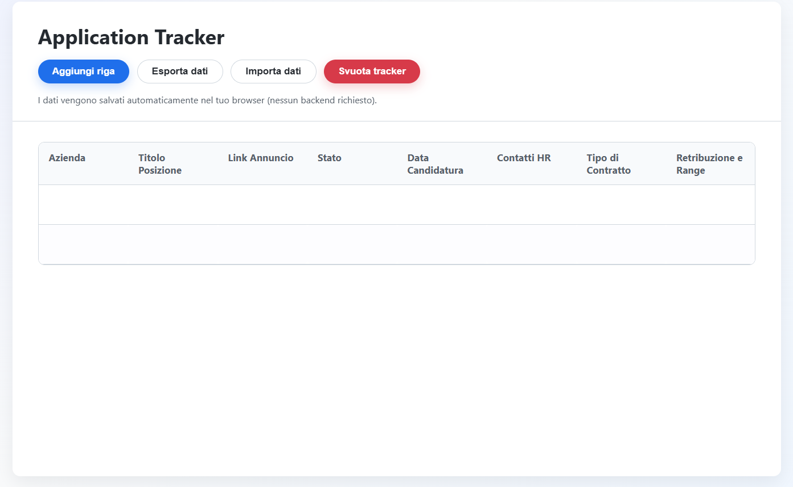

# Application Tracker

Application Tracker è un foglio di calcolo interattivo in pure HTML/CSS/JavaScript pensato per monitorare le candidature durante una ricerca di lavoro. I dati vengono salvati nel `localStorage` del browser, quindi non richiede un backend né configurazioni complesse.

## Anteprima


## Funzionalità principali
- Aggiungi, duplica ed elimina righe con un solo click
- Salvataggio automatico dei dati nel browser
- Import/Export in JSON per creare backup o spostare i dati su un altro dispositivo
- Campi dedicati per informazioni chiave (stato, follow-up, contatti HR, retribuzione, note, ecc.)
- Interfaccia completamente localizzata in italiano

## Requisiti
- Un browser moderno (Chrome, Firefox, Edge, Safari)
- Nessuna dipendenza esterna o build tool: il progetto è completamente statico

## Avvio rapido
1. Clona o scarica il repository.
2. Apri `index.html` con il tuo browser preferito.
3. Inizia ad aggiornare le celle della tabella: i dati vengono salvati automaticamente.

> Suggerimento: premi `Ctrl+S` (o `Cmd+S` su macOS) per forzare il salvataggio immediato nel `localStorage`.

## Esportazione e importazione
- **Esporta dati**: genera un file JSON formattato con tutte le candidature (comodo per backup o migrazione).
- **Importa dati**: carica un JSON precedentemente esportato; le righe vengono normalizzate e gli ID rigenerati se mancanti.
- **Svuota tracker**: ripristina la tabella alla riga vuota iniziale. L'operazione è irreversibile.

## Struttura del progetto
```
Application Tracker/
├── index.html   # Struttura della pagina e template riga
├── script.js    # Logica dell'app: storage, eventi, import/export
└── style.css    # Stili dell'interfaccia e tabella
```

## Personalizzazione
- Aggiorna `style.css` per modificare l'aspetto.
- Modifica l'array `COLUMN_KEYS` in `script.js` per aggiungere/rimuovere colonne (ricorda di aggiornare anche la `<table>` in `index.html`).

## Supporto
Apri una issue con una descrizione chiara del problema o della funzionalità desiderata. Allegare screenshot e JSON di esportazione aiuta a riprodurre il comportamento.

## Licenza
Questo progetto è distribuito sotto licenza [GNU General Public License v3.0](LICENSE). Consulta il file per i termini completi.
